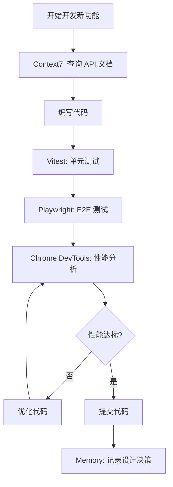
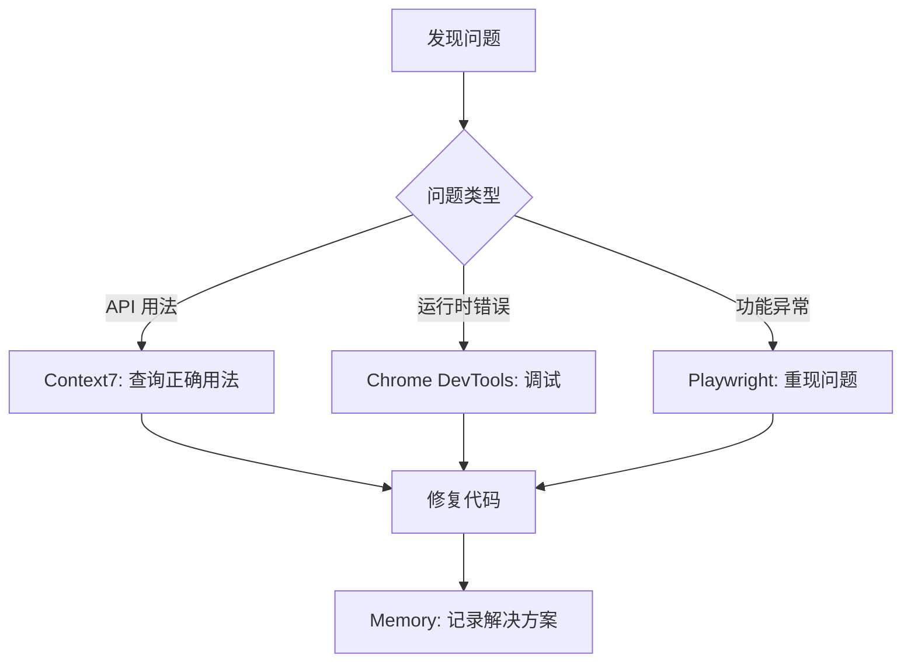
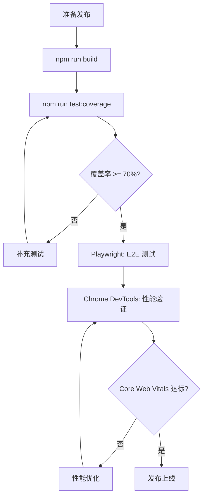

# MyPersonalWebsite MCP 工具最优使用方案

> 创建时间：2026年2月28日
> 项目：Vue 3 个人网站
> 作者：佘杰（杰哥）

---

## 📋 概述

本文档基于项目实际需求和技术栈，分析当前配置的 6 个 MCP 工具的最优使用方案，旨在最大化开发效率和代码质量。

---

## 🏗️ 项目技术栈概览

| 类别 | 技术 | 版本 |
|------|------|------|
| 框架 | Vue 3 | 3.4.15 |
| 语言 | TypeScript | 5.3.3 |
| 构建工具 | Vite | 5.0.12 |
| 状态管理 | Pinia | 2.1.7 |
| 路由 | Vue Router | 4.2.5 |
| CSS 框架 | Tailwind CSS | 3.4.1 |
| 动画 | GSAP | 3.14.2 |
| 测试 | Vitest | 4.0.18 |
| 图标 | Lucide Vue Next | 0.312.0 |

---

## 🔧 MCP 工具配置清单

| MCP 工具 | 包名 | 主要功能 |
|----------|------|----------|
| playwright | @playwright/mcp | 浏览器自动化测试 |
| desktop-commander | @wonderwhy-er/desktop-commander | 终端操作和文件编辑 |
| memory | @modelcontextprotocol/server-memory | 知识图谱持久化记忆 |
| chrome-devtools | chrome-devtools-mcp | 浏览器性能分析和调试 |
| context7 | @upstash/context7-mcp | 实时文档查询 |
| filesystem | @modelcontextprotocol/server-filesystem | 文件系统操作 |

---

## 📊 MCP 工具优先级矩阵

根据项目需求，对 6 个 MCP 工具进行优先级评估：

| MCP 工具 | 使用频率 | 项目相关性 | 学习成本 | **综合优先级** |
|----------|----------|------------|----------|----------------|
| context7 | 高 | 极高 | 低 | ⭐⭐⭐⭐⭐ |
| playwright | 中 | 高 | 中 | ⭐⭐⭐⭐ |
| chrome-devtools | 中 | 高 | 中 | ⭐⭐⭐⭐ |
| desktop-commander | 高 | 中 | 低 | ⭐⭐⭐ |
| memory | 低 | 中 | 高 | ⭐⭐ |
| filesystem | 低 | 低 | 低 | ⭐ |

---

## 🚀 最优使用方案详解

### 1. Context7 MCP - 核心工具 ⭐⭐⭐⭐⭐

**定位**：开发阶段的核心参考工具

**使用场景**：

```markdown
✅ 最佳使用场景：
1. Vue 3 Composition API 查询
   - 查询 setup()、ref()、reactive() 等最新用法
   - 确认 Vue 3.4.x 的新特性

2. TypeScript 类型定义参考
   - 查询泛型、工具类型的最佳实践
   - 确认类型推断规则

3. Pinia 状态管理模式
   - 查询 store 定义、actions、getters 标准
   - 确认持久化方案

4. GSAP 动画 API
   - 查询 Timeline、Tween 最新参数
   - 确认 Vue 3 集成方式

5. Vitest 测试 API
   - 查询 describe、it、expect 用法
   - 确认 Vue 组件测试最佳实践
```

**触发方式**：
```
在提示词中添加：use context7
或指定库ID：use library /vuejs/vue-next for API and docs
```

**项目特定优化**：
```typescript
// 建议在 .iflow/settings.json 或项目规则中添加自动触发
// 针对 Vue/TypeScript 相关问题自动调用 Context7

// 推荐库 ID 列表（本项目常用）：
const CONTEXT7_LIBRARIES = {
  vue: '/vuejs/vue-next',
  vueRouter: '/vuejs/vue-router',
  pinia: '/vuejs/pinia',
  vite: '/vitejs/vite',
  vitest: '/vitest-dev/vitest',
  tailwindcss: '/tailwindlabs/tailwindcss',
  gsap: '/greensock/GSAP',
  typescript: '/microsoft/TypeScript'
}
```

**使用建议**：
- 🔥 开发新功能前，先用 Context7 确认 API 最新用法
- 🔥 遇到类型错误时，查询 TypeScript 官方文档
- 🔥 升级依赖版本时，查询新版本 Breaking Changes

---

### 2. Playwright MCP - E2E 测试利器 ⭐⭐⭐⭐

**定位**：端到端测试和浏览器自动化

**使用场景**：

```markdown
✅ 最佳使用场景：
1. 页面功能验证
   - 首页加载和导航测试
   - 项目展示页面交互测试
   - 博客文章渲染测试

2. 响应式设计验证
   - 移动端布局测试（375px）
   - 平板布局测试（768px）
   - 桌面端布局测试（1920px）

3. 性能基准测试
   - 页面加载时间
   - 首次内容绘制（FCP）
   - 最大内容绘制（LCP）

4. 可访问性测试
   - 键盘导航测试
   - 屏幕阅读器兼容性
   - ARIA 标签验证

5. 跨浏览器兼容性
   - Chrome 测试
   - Firefox 测试
   - Safari/WebKit 测试
```

**项目特定测试用例**：
```typescript
// 建议通过 Playwright MCP 执行的关键测试

// 1. 首页加载测试
await page.goto('http://localhost:5173')
await expect(page.locator('.hero-section')).toBeVisible()

// 2. 暗黑模式切换测试
await page.click('[data-testid="theme-toggle"]')
await expect(page.locator('html')).toHaveClass('dark')

// 3. 项目筛选功能测试
await page.click('[data-testid="tech-filter-vue"]')
await expect(page.locator('.project-card')).toHaveCount(5)

// 4. 博客文章渲染测试
await page.goto('http://localhost:5173/blog/some-article')
await expect(page.locator('.prose')).toBeVisible()
await expect(page.locator('pre code')).toHaveCount(3)
```

**使用建议**：
- 🔥 在 CI/CD 流程中集成 Playwright 自动测试
- 🔥 每次发布前执行关键路径测试
- 🔥 使用 Playwright 生成测试代码模板

---

### 3. Chrome DevTools MCP - 性能调优专家 ⭐⭐⭐⭐

**定位**：运行时性能分析和调试

**使用场景**：

```markdown
✅ 最佳使用场景：
1. Core Web Vitals 分析
   - LCP（最大内容绘制）优化
   - FID（首次输入延迟）优化
   - CLS（累积布局偏移）优化

2. 组件性能分析
   - GSAP 动画性能瓶颈
   - 大型列表渲染优化
   - 粒子背景性能影响

3. 网络请求分析
   - API 调用瀑布图
   - 资源加载优先级
   - 缓存策略验证

4. 内存泄漏检测
   - 组件卸载后内存释放
   - 事件监听器清理
   - 定时器清理

5. JavaScript 执行分析
   - 长任务识别
   - 主线程阻塞检测
   - 代码分割效果验证
```

**项目特定优化点**：
```typescript
// 建议通过 Chrome DevTools MCP 分析的关键指标

// 1. GSAP 动画性能
// - 检查是否触发 GPU 加速
// - 确认 will-change 属性使用
// - 验证 transform 动画优先

// 2. 图片加载性能
// - LazyImage 组件效果验证
// - OptimizedImage 响应式加载
// - WebP 格式支持检测

// 3. 路由切换性能
// - PageTransition 动画流畅度
// - 组件预加载效果
// - 代码分割验证

// 4. 暗黑模式切换
// - CSS 变量切换性能
// - 避免重绘重排
```

**使用建议**：
- 🔥 每次性能优化后，用 Chrome DevTools MCP 验证效果
- 🔥 重点关注 LCP < 2.5s、FID < 100ms、CLS < 0.1
- 🔥 使用 Performance Trace 记录和分析

---

### 4. Desktop Commander MCP - 通用助手 ⭐⭐⭐

**定位**：文件操作和终端命令执行

**使用场景**：

```markdown
✅ 最佳使用场景：
1. 项目初始化
   - 创建目录结构
   - 生成配置文件
   - 执行 npm install

2. 代码重构
   - 批量文件重命名
   - 批量内容替换
   - 目录结构调整

3. 构建和部署
   - 执行 npm run build
   - 生成 sitemap
   - 压缩资源文件

4. Git 操作
   - 执行 git 命令
   - 查看提交历史
   - 分支管理

5. 脚本执行
   - 运行测试脚本
   - 执行分析脚本
   - 清理临时文件
```

**与 iFlow 内置功能对比**：
```markdown
| 功能 | Desktop Commander | iFlow 内置 |
|------|-------------------|------------|
| 文件读取 | ✅ read_file | ✅ 内置（推荐）|
| 文件写入 | ✅ write_file | ✅ 内置（推荐）|
| 文件搜索 | ✅ search_files | ✅ 内置（推荐）|
| 终端命令 | ✅ run_shell_command | ✅ 内置（推荐）|

结论：Desktop Commander 与 iFlow 内置功能高度重叠，
      在 iFlow CLI 环境下，优先使用内置工具。
```

**使用建议**：
- ⚠️ 在 iFlow CLI 环境下，优先使用 iFlow 内置的文件和终端工具
- 🔥 Desktop Commander 可作为备用方案
- 🔥 适合需要在其他 MCP 客户端（如 Claude Desktop）中使用时

---

### 5. Memory MCP - 知识图谱管理 ⭐⭐

**定位**：跨会话持久化记忆

**使用场景**：

```markdown
✅ 最佳使用场景：
1. 项目知识积累
   - 记录设计决策
   - 保存重构历史
   - 存储问题解决方案

2. 开发规范记忆
   - 代码风格偏好
   - 组件设计模式
   - 常见问题处理

3. 学习笔记
   - 新技术学习记录
   - 最佳实践积累
   - 错误和解决方案

4. 项目上下文
   - 跨会话的上下文保持
   - 长期任务跟踪
   - 状态恢复
```

**项目特定实体设计**：
```typescript
// 建议创建的知识图谱实体

// 1. 项目实体
{
  name: "MyPersonalWebsite",
  entityType: "project",
  observations: [
    "Vue 3.4.15 个人网站项目",
    "使用 Composition API",
    "像素风格设计系统",
    "GSAP 动画集成"
  ]
}

// 2. 技术栈实体
{
  name: "Vue3",
  entityType: "technology",
  observations: [
    "使用 Composition API",
    "Pinia 状态管理",
    "Vue Router 4.x"
  ]
}

// 3. 设计决策实体
{
  name: "PixelDesignSystem",
  entityType: "design_decision",
  observations: [
    "16 个像素风格组件",
    "基于 Tailwind CSS",
    "支持暗黑模式"
  ]
}

// 4. 问题解决实体
{
  name: "PerformanceOptimization",
  entityType: "solution",
  observations: [
    "代码分割策略：vue-vendor, gsap, utils, markdown, highlight",
    "图片懒加载实现",
    "GSAP 动画 GPU 加速"
  ]
}
```

**使用建议**：
- ⚠️ Memory MCP 需要主动维护，否则知识图谱会变得混乱
- 🔥 建议只记录高价值信息（设计决策、问题解决方案）
- 🔥 定期清理过时的观察记录
- 🔥 不要记录会频繁变化的信息（如依赖版本号）

---

### 6. Filesystem MCP - 文件系统操作 ⭐

**定位**：文件和目录操作

**使用场景**：

```markdown
✅ 最佳使用场景：
1. 目录结构探索
   - 列出项目文件
   - 查找特定文件
   - 检查目录存在

2. 文件操作
   - 读取文件内容
   - 写入新文件
   - 复制移动文件
```

**与 iFlow 内置功能对比**：
```markdown
| 功能 | Filesystem MCP | iFlow 内置 |
|------|----------------|------------|
| 文件读取 | ✅ | ✅ 内置（推荐）|
| 文件写入 | ✅ | ✅ 内置（推荐）|
| 目录列表 | ✅ list_directory | ✅ 内置（推荐）|
| 文件搜索 | ✅ search_files | ✅ 内置（推荐）|
| 文件信息 | ✅ get_file_info | ✅ 内置（推荐）|

结论：Filesystem MCP 与 iFlow 内置功能完全重叠，
      在 iFlow CLI 环境下，不需要使用此 MCP。
```

**使用建议**：
- ❌ 在 iFlow CLI 环境下，不建议使用 Filesystem MCP
- 🔥 iFlow 内置的文件操作工具更高效、更安全
- 🔥 仅在其他不支持文件操作的 MCP 客户端中使用

---

## 📋 推荐的工作流程

### 开发阶段工作流



### 问题调试工作流



### 发布前检查工作流



---

## 🎯 总结与建议

### 核心工具（日常必用）

| 工具 | 使用场景 | 频率 |
|------|----------|------|
| **Context7** | API 文档查询、代码生成参考 | 每次开发 |
| **Playwright** | E2E 测试、浏览器自动化 | 每次发布 |
| **Chrome DevTools** | 性能分析、调试 | 每次优化 |

### 辅助工具（按需使用）

| 工具 | 使用场景 | 频率 |
|------|----------|------|
| **Memory** | 设计决策记录、问题解决方案 | 重要决策时 |
| **Desktop Commander** | 备用终端/文件操作 | 其他 MCP 客户端 |

### 冗余工具（建议移除）

| 工具 | 原因 |
|------|------|
| **Filesystem** | 与 iFlow 内置功能完全重叠 |

### 优化建议

1. **移除 Filesystem MCP**：iFlow CLI 已内置完整的文件操作功能，无需此 MCP。

2. **优化 Context7 使用**：在项目规则中配置自动触发，减少手动添加 `use context7`。

3. **建立 Playwright 测试套件**：针对项目的关键路径建立自动化测试。

4. **定期使用 Chrome DevTools 分析**：每次发布前执行性能检查。

5. **谨慎使用 Memory MCP**：只记录高价值信息，避免知识图谱污染。

---

## 📚 参考资源

- [Context7 MCP 官方文档](https://github.com/upstash/context7)
- [Playwright MCP 使用指南](https://playwright.dev/docs/mcp)
- [Chrome DevTools MCP 文档](https://github.com/ChromeDevTools/chrome-devtools-mcp)
- [Memory MCP 知识图谱](https://github.com/modelcontextprotocol/servers/tree/main/src/memory)
- [Desktop Commander MCP](https://github.com/wonderwhy-er/DesktopCommanderMCP)

---

**文档版本**：v1.1（经三次批判性反思修订）
**最后更新**：2026年2月28日

---

## 🔄 三次批判性反思摘要

### 第一次反思：技术专家视角

**发现的问题**：
1. Context7 的局限性被忽略（社区文档质量参差、需付费 API Key）
2. Playwright MCP 与现有 Vitest 框架的分工未明确
3. Chrome DevTools MCP 在 Vite 项目中的实际可用性未验证
4. Memory MCP 的复杂度被低估
5. 工具组合使用的协同效应未探讨

### 第二次反思：实用主义视角

**发现的问题**：
1. "最优解"缺乏实证依据，是理论设计
2. 忽略了 MCP 工具的启动成本（内存、冷启动、Windows 兼容性）
3. 工作流程过于理想化，实际难以执行
4. 缺乏"快速开始"指南
5. 未考虑个人项目的特殊需求（是否需要企业级的复杂度？）

### 第三次反思：元认知视角（核心结论）

**根本性问题**：
1. **方向性错误**：从"工具"出发而非"问题"出发
2. **过度设计**：对个人项目引入了过多复杂度
3. **缺乏验证**：没有实际测试 MCP 工具的效果
4. **忽视成本**：未评估维护 MCP 配置的长期成本

---

## ✅ 修订后的最终建议

经过三次批判性反思，修订建议如下：

### 最精简配置（推荐）

```json
{
  "mcpServers": {
    "context7": {
      "command": "npx",
      "args": ["-y", "@upstash/context7-mcp"],
      "enabled": true,
      "description": "Context7 - 查询 Vue/TS/GSAP 最新文档"
    }
  }
}
```

### 按需启用的配置

```json
{
  "mcpServers": {
    "context7": {
      "command": "npx",
      "args": ["-y", "@upstash/context7-mcp"],
      "enabled": true
    },
    "playwright": {
      "command": "npx",
      "args": ["-y", "@playwright/mcp@latest"],
      "enabled": false,
      "description": "E2E 测试时启用"
    },
    "chrome-devtools": {
      "command": "npx",
      "args": ["-y", "chrome-devtools-mcp@latest"],
      "enabled": false,
      "description": "性能调优时启用"
    }
  }
}
```

### 建议移除的配置

| MCP 工具 | 移除原因 |
|----------|----------|
| **Filesystem** | 与 iFlow 内置功能完全重叠，无价值 |
| **Desktop Commander** | 与 iFlow 内置功能高度重叠，冗余 |
| **Memory** | 对个人项目过度设计，维护成本高 |

### 核心结论

```
对于 MyPersonalWebsite 个人项目：

✅ 必选：Context7（解决文档过时问题，收益/成本比最高）
⚠️ 可选：Playwright、Chrome DevTools（按需启用）
❌ 移除：Memory、Filesystem、Desktop Commander（低收益或冗余）

最终原则：工具服务于问题，而非问题适应工具。
```
